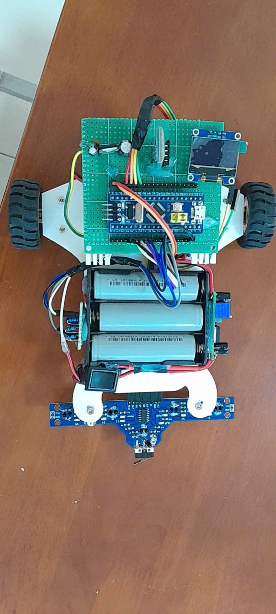

# Line Follower Robot Firmware Using STM32F103

This repository contains the firmware for a line follower robot project using the STM32F103 microcontroller.

## Features

- **Line Following**: The robot follows a predefined line using sensor-based feedback.
- **PID Control**: Implements Proportional-Integral-Derivative (PID) control for smooth and precise motor adjustments.
- **OLED Display**: Shows real-time data such as PID parameters, battery status, and system diagnostics on an SSD1306 OLED screen.
- **Bluetooth Tuning**: Enables dynamic adjustment of PID parameters and speed settings via Bluetooth.
- **Battery Monitoring**: Tracks battery voltage and provides visual alerts for low battery levels.

## Getting Started

### Prerequisites

To build and run this project, you will need:

- **STM32CubeIDE**: Version 1.13.2 or later.
- **STM32 HAL/LL Drivers**: Included in the STM32CubeIDE package.
- **Hardware**: STM32F103 microcontroller, SSD1306 OLED display, line sensors, motor driver, and Bluetooth module.

### Usage

1. Power on the robot and place it on the track.
2. Adjust PID parameters via the Bluetooth interface as needed.
3. Monitor real-time system feedback on the OLED display.

## Acknowledgments

**Team Members**:
- **Trinh Quoc Bao**: Project Lead and PID Control Implementation  
- **Tran Trong Tin**: Hardware Design and Firmware Development  
- **Le Anh Khoa**: Hardware Design  and Bluetooth Integration